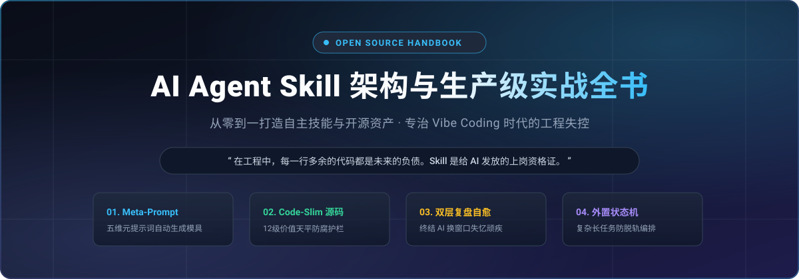

 
 

 
 

### [👉 点击进入：网页版在线阅读（体验最佳） 👈](https://yibeigen.github.io/AI-Agent-Skill-Handbook/)

[从第 01 章开始阅读](book/chapters/01-重新理解Skill_给AI发一张上岗资格证.md) · [配套开源实战](#配套开源实战工具) · [发刊词](#发刊词为什么开源写这本书) · [交流与支持](#关于作者与技术交流)

---

## 发刊词：为什么开源写这本书？

过去这大半年，我和大家一样，几乎把全部编码工作都迁移到了 AI 辅助环境（Cursor、Claude Code、Trae、Antigravity）中。

从最初的惊艳，到后来深深的工程疲惫——我相信每个严肃的一线开发者都曾遭遇过这四大心力交瘁的时刻：
1. **屎山膨胀**：交代一个 10 行就能写完的格式校验，AI 自作多情生成了 100 行包含单例工厂、抽象接口的过度设计代码；
2. **安全隐患**：稍不注意就生成了明文密码、未加清洗的 SQL 拼接与无鉴权的路由；
3. **换窗口失忆**：聊得好好的，上下文一满换新窗口，花了几个小时灌输的代码习惯和架构规范全部烟消云散，又要从头调教；
4. **协作撞车**：多人用 AI 协作，各自的 Agent 互相覆盖代码、越权乱改。

在对话框里把 Prompt 写得越来越长，最终非但没有让 AI 变聪明，反而因为注意力稀释，加速了工程滑向失控。

市面上的资料，要么是零碎无用的 Prompt 小技巧，要么是官方文档的生硬搬运。**行业极度缺乏一套能真正跑通在生产环境、工程化治愈 AI 失控的硬核手册。**

所以我决定把在真实高强度业务中踩坑、淬炼出的整套 **生产级 Skill 架构、防御契约、状态机规范与 Meta-Prompt 元提示词框架** 毫无保留地写出来，并且**全盘永久免费开源**。

不仅授人以鱼，交付可以直接导入项目的 6 大工业级 Skill（如专治屎山的 `Code-Slim` 等）；更授人以渔，教你指挥 AI 做出属于你自己的生产力护栏。

---

## 全书目录与实战导航

> 阅读提示：每一章顶部与底部均配有前后翻页导航，点击即可顺畅沉浸式阅读。

| 篇章 | 章节标题 | 核心解决问题 / 关键交付 | 配套实战代码 / Skill | 预计用时 | 状态 |
| :---: | :--- | :--- | :---: | :---: | :---: |
| **导论** | **[第 01 章：重新理解 Skill：给 AI 发一张“上岗资格证”](book/chapters/01-重新理解Skill_给AI发一张上岗资格证.md)** | 破除长 Prompt 迷信，解剖标准 Skill 三层骨架 | 标准 `SKILL.md` 骨架 | ~8 分钟 | 已完结 |
| **工具** | **[第 02 章：授人以渔：用 AI Agent 从 0 到 1 编写 Skill 的元提示词工程](book/chapters/02-授人以渔_用AIAgent从0到1编写Skill的元提示词工程.md)** | 五维生成法，指挥 AI 自动化生成防御级技能 | Meta-Prompt 模板 | ~12 分钟 | 已完结 |
| **实战** | **[第 03 章：代码防腐实战：用价值序列表专治 AI 屎山与过度抽象](book/chapters/03-代码防腐实战_用价值序列表专治AI屎山与过度抽象.md)** | 专治代码过度设计、行数膨胀与乱放位置 | [Code-Slim 源码](https://github.com/yibeigen/Code-Slim) | ~15 分钟 | 已完结 |
| **实战** | **[第 04 章：研发自愈与外置记忆：双层复盘机制构建项目专属抗体](book/chapters/04-研发自愈与外置记忆_双层复盘机制构建项目专属抗体.md)** | 解决换窗口失忆，将排错经验固化为本地护栏 | [ai-task-troubleshooter](https://github.com/yibeigen/ai-task-troubleshooter) | ~15 分钟 | 已完结 |
| **协作** | **[第 05 章：多人协作防撞车：泳道隔离与红线防御机制](book/chapters/05-多人协作防撞车_泳道隔离与红线防御机制.md)** | 解决团队多人多 AI 协作时的代码覆盖与越权 | `vibe-team-lanes` | ~12 分钟 | 待连载 |
| **进阶** | **[第 06 章：复杂长链路编排：外置状态机让 Agent 永不脱轨](book/chapters/06-复杂长链路编排_外置状态机让Agent永不脱轨.md)** | 跨窗口长任务编排，杜绝中途失忆与乱序执行 | `openbook-factory` 引擎 | ~18 分钟 | 待连载 |
| **结语** | **[第 07 章：工程闭环与开源共建：把你的生产级 Skill 推向世界](book/chapters/07-工程闭环与开源共建_把你的生产级Skill推向世界.md)** | 规范化打包、安全自测、README 规范与开源影响力沉淀 | 开源发版 Checklist | ~10 分钟 | 待连载 |

---

## 配套开源实战工具

本书不仅仅是一套方法论，书中所有案例均沉淀为真实生产级开源仓库，读者可直接 Clone 或复制到各自项目的 `.agents/skills/` 中即刻生效：

- **[Code-Slim](https://github.com/yibeigen/Code-Slim)**：专治 AI 代码过度膨胀与过度设计的防腐护栏（第 03 章实战配套）。
- **[ai-task-troubleshooter](https://github.com/yibeigen/ai-task-troubleshooter)**：外置双层排错经验库与自愈抗体生成器，让经验跨会话永久继承（第 04 章实战配套）。
- **vibe-team-lanes**：多开发者多 Agent 并行协作的泳道隔离与防御规约（第 05 章实战配套）。
- **openbook-factory**：驱动多阶段长文长链路创作的外置状态机引擎（第 06 章实战配套）。

---

## 关于作者与技术交流

我是 **艺杯羹**，一线研发与独立开发者，长期关注 AI Agent 架构体系与开发者生产力工程化。

如果你在阅读本书、开发自己的专属 Skill 或在团队中落地 AI 编程规范时遇到任何疑问，欢迎交流：

<table>
<tr>
<td align="center" width="50%">
 
<b>关注微信公众号【艺杯羹】</b> 
第一时间获取深度技术思考、开源更新与内测福利
</td>
<td align="center" width="50%">
 
<b>请作者喝杯咖啡</b> 
如果本书或开源 Skill 对你有所启发，感谢你的赞赏鼓励
</td>
</tr>
</table>

### 更多平台

[个人主页](https://yibeigen.pages.dev/) &nbsp;·&nbsp; 
[CSDN 博客专栏](https://blog.csdn.net/qq_46987323?spm=1000.2115.3001.5343) &nbsp;·&nbsp; 
[新浪微博 @艺杯羹](https://www.weibo.com/u/7583841270) &nbsp;·&nbsp; 
[GitHub @yibeigen](https://github.com/yibeigen)

**联系与交流**：
- 微信号：`peace-83`（添加请备注：Skill实战交流）
- QQ：`3057454077`

---

## Star 计划与社区共建

全书完全开源免费，如果你觉得这些内容和实战 Skill 对你的日常开发确实有帮助，欢迎为本项目点亮一个 Star。这是持续更新后续章节与迭代开源工具的重要动力。

- [x] **100 Stars**：开源 `Code-Slim` 极简版规则与源码
- [ ] **300 Stars**：上线全书一键安装脚本（自动装配核心 Skill 到本地项目）
- [ ] **500 Stars**：举办线上实战答疑《从零带你手搓生产级 Skill》
- [ ] **1000 Stars**：发布配套的 Skill 自动化测试与评估开源 CLI

---

## 开源协议

本书正文内容采用 [知识共享署名-非商业性使用-相同方式共享 4.0 国际许可协议 (CC BY-NC-SA 4.0)](https://creativecommons.org/licenses/by-nc-sa/4.0/) 进行许可。配套开源代码遵循 MIT 协议。
