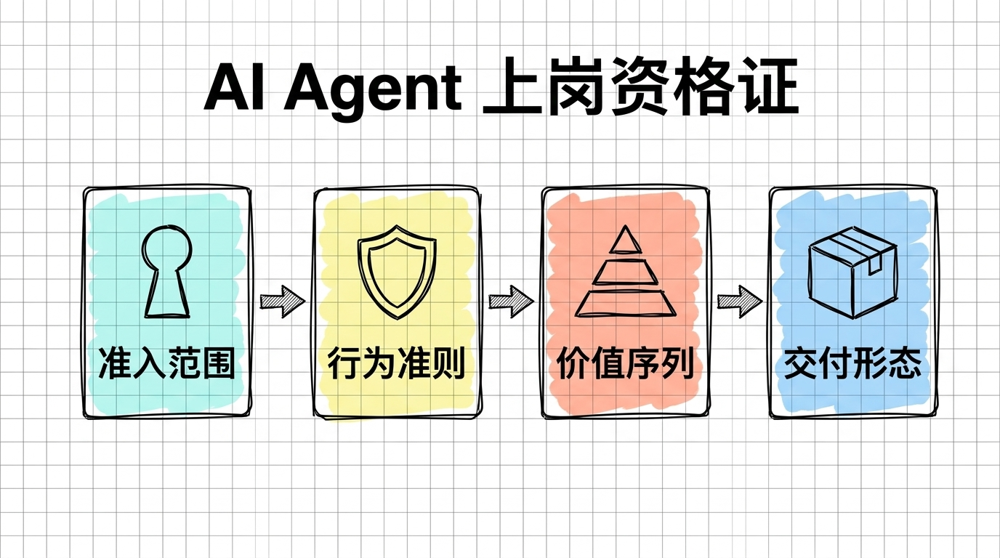
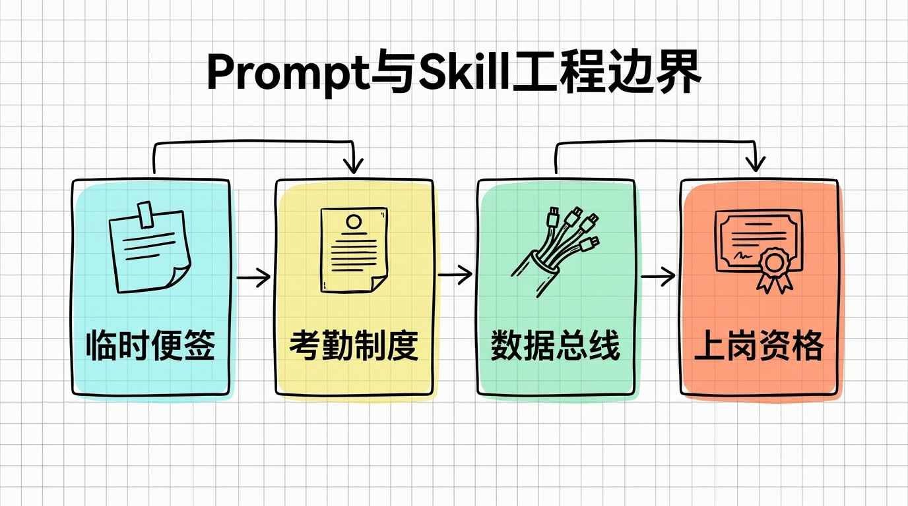

> **[《AI Agent Skill 架构与生产级实战全书》](../../README.md)**  
> 上一章：[全书目录](../../README.md) ｜ [返回总目录](../../README.md) ｜ 下一章：[第 02 章：授人以渔：用 AI Agent 从 0 到 1 编写 Skill 的元提示词工程](02-授人以渔_用AIAgent从0到1编写Skill的元提示词工程.md)

# 第 01 章 重新理解 Skill：给 AI 发一张“上岗资格证”

过去这大半年，我几乎把全部编码工作都迁移到了 AI 辅助环境里。

从最初在对话框里复制粘贴代码片段，到后来直接使用 Trae、Cursor、Claude Code 进行全工程级 Vibe Coding，那种只要说出需求、看着代码在屏幕上自动飞速生成的爽快感，确实让人上瘾。

但在连续高强度交付了几个真实业务项目之后，这种爽快感迅速被一种前所未有的工程疲惫所取代。

只要稍微把项目规模放大，把代码行数推到几千行以上，AI 就会开始频繁脱轨。

在对话框里写得越来越长的提示词，最终非但没有让 AI 变得更聪明，反而像不断叠加的补丁一样，让整个工程迅速滑向失控的边缘。

# 1. Vibe Coding 的四大翻车现场

如果经常使用 AI 写代码，以下这四个场景大概率并不陌生。

## 1.1. 屎山代码的自发性堆积

这是最让我头疼的一个毛病：AI 天生极度喜欢“自作多情”。

有一次我只需要写一个轻量的手机号格式校验函数，如果用标准正则表达式配合两行逻辑，十来行代码就能干脆利落地解决战斗。

结果把需求交代给 AI 之后，它直接洋洋洒洒生成了整整一个独立文件，接近一百行代码。

```typescript
// AI 自作多情生成的膨胀代码：原本只需 10 行，硬生生搞出单例工厂与抽象接口
export interface PhoneNumberValidatorConfig { /* 根本用不上的冗余参数 */ }

export class PhoneNumberValidatorFactory {
    private static instance: PhoneNumberValidatorFactory;
    public static getInstance() { /* 繁琐的单例初始化逻辑 */ }

    public createValidator(config?: PhoneNumberValidatorConfig) {
        return {
            validate: (input: string) => {
                // 嵌套了三层包装类与过度设计的抽象结果对象...
                return new PhoneNumberValidationResult(/^1[3-9]\d{9}$/.test(input));
            }
        };
    }
}
```

它甚至自作主张为这十行逻辑设计了单例工厂、抽象配置接口、以及封装了错误码的结果包装类。

在真实业务里，这类过度设计的代码一旦被放进仓库，后续的维护者就要被迫去理解那些毫无意义的工厂与抽象层。

AI 默认认为“写得越多越显得专业、越安全”，而真相恰恰相反——在工程中，每一行多余的代码都是未来不得不偿还的债务。

## 1.2. 悄无声息的安全漏洞

AI 擅长模仿语法，但它本身缺乏真正的安全态势感知。

在快速生成接口时，稍不留神就会发现它直接把前端传入的参数未加清洗地拼进 SQL 语句，或者在代码里为了图方便，直接硬编码明文密钥。

更有甚者，它会生成一段逻辑看似极其严密、实际上完全跳过了鉴权拦截的控制器代码。

只要开发者稍有松懈、没有逐行审计，这些隐蔽漏洞就会堂而皇之地混入生产环境。

## 1.3. 换个窗口，记忆彻底归零

单次对话的上下文窗口是有物理极限的。

随着代码量上升，单个聊天窗口很快就会被冗长的上下文撑爆，AI 的响应速度明显变慢，逻辑也开始变得胡言乱语。

为了保持推理速度与准确率，我不得不频繁开启新会话。

但只要一换对话窗口，之前花了几个小时给它灌输的变量命名习惯、项目架构约束、特殊业务逻辑约定，全部烟消云散。

前天刚让它改掉的坏习惯，新窗口里它又一模一样地重新犯了一遍，每一次开新对话都变成了折磨人的从头调教。

## 1.4. 千篇一律的 AI 塑料感

无论是让它写前端组件还是设计布局，它默认套用的风格永远是那几套：浮夸的高饱和度渐变色、无处不在的圆角投影、以及白天在强光下刺眼疲劳的纯黑赛博朋克风。

界面一眼看上去像是技术演示 Demo，完全无法支撑起严谨商业软件该有的克制与呼吸感。

# 2. 为什么靠堆砌 Prompt 根本救不了工程？

面对上面这些翻车现场，最初的本能反应通常是把 Prompt 写得再长一点、再详细一点。

我也曾经这样干过。在每次提需求时，前面往往要挂上几百字的要求，交代代码要精简、不要过度封装、注意 SQL 防注入、使用驼峰命名等等。

但很快我就发现，这条路彻底走不通。

首先是大模型的注意力稀释。当提示词又长又碎、夹杂在大量业务逻辑中时，模型会自动“挑食”，往往重点记住了后面的业务描述，前面的几十条红线全被当成了耳边风。

更要命的是常规 Prompt 缺乏状态阻断机制。它只是单向发送给模型的建议，模型生成错误代码时没有任何拦截卡点，依然会自信满满地输出一堆屎山，最终还是得靠人工肉眼去挑刺。

而且写在会话里的提示词是一次性的。换一个工程、换一台电脑、或者换一个编辑器，这些宝贵的约束全部失效，根本无法沉淀为可复用的工程资产。

这时候，必须要有一种更高维度的工具，把散乱的口头约定变成可执行、可检验的工程制度。这就是 Skill 的立足之本。

# 3. 破局之道：给 AI 发一张“上岗资格证”

如果把大语言模型比作一个刚从顶尖名校毕业、智商极高但完全没有在真实软件企业里打过卡的新员工。

常规的 Prompt，就像每天早上在工位上对它口头交代一万句注意规范别写 bug，它嘴上答应得很好，一转身该犯的错一个不落。

而 Skill 的本质，就是给这个 AI 员工正式颁发一张盖了公章的“上岗资格证”。



在这张上岗资格证里，明确写死了它的工作边界与禁令。比如写新功能时严禁为了十来行逻辑搞单例工厂，架构冲突时代码在正确位置永远排在第一位，甚至规定了在什么时候必须主动挂起对话交由人工确认。

更重要的是，这张资格证不是口头约定的，它以物理文件的形式常驻在项目的规则系统里。只要触发对应场景，编辑器会自动把整套规范以最高优先级注入到模型的决策链路底层，成为不可违背的铁律。

# 4. 概念厘清：Prompt、Rule、MCP 与 Skill 的边界

在目前的 AI 编程生态中，各类术语漫天飞舞。把它们的物理边界划分清楚，后续在做技术选型时才不会陷入混乱。

| 概念 | 真实定位 | 生命周期 | 典型代表 / 核心作用 |
|---|---|---|---|
| **Prompt（提示词）** | 即时会话指令 | 单次交互，随对话关闭而消亡 | “帮我把这个函数改成异步”、“解释一下这段报错” |
| **System Rule（系统规则）** | 全局静态偏好 | 项目级或全局常驻，每次对话被动附带 | “默认使用 TypeScript”、“缩进用 2 个空格”、“中文回答” |
| **MCP（模型上下文协议）** | 外部数据与工具总线 | 服务进程常驻，按需提供 I/O 数据流 | 读取本地数据库、操作浏览器、调用外部 GitHub API |
| **Skill（任务技能包）** | 自主复合工作流护栏 | 独立模块化，依据场景动态挂载或自主触发 | **`code-slim`（代码瘦身）**、**`openbook-factory`（专栏工厂）** |

如果把这些概念放到真实的研发办公室里，边界就极其直观：Prompt 是随手递过去的一张临时便签纸，Rule 是贴在墙上的通用考勤制度，MCP 是配发给工程师的网线与数据转接头，而 Skill 则是经过考核认证的专项工程师作业手册，内部完整封装了排错 SOP、防御红线与自测脚本。



# 5. 解剖标准 Skill：一个工业级 SKILL.md 到底长什么样？

了解了 Skill 的心智模型之后，回到具体的工程落地：一个合格的 Skill 在本地到底是一个怎样的存在？

以现代主流 AI 编辑器和 Agent 系统遵循的开放标准为例，一个标准的 Skill 通常是一个独立的文件夹，核心入口文件就是 `SKILL.md`。

```
my-awesome-skill/
├── SKILL.md          # 核心契约（元数据 + 触发规则 + 执行规约）
├── checklists/       # 校验清单（可选：如 ai-smell.md 去机器味清单）
├── scripts/          # 自动化辅助脚本（可选：如校验脚本、打包脚本）
└── templates/        # 规范模板（可选：如输出报告模板、状态机模板）
```

打开其中的 `SKILL.md`，最核心的骨架范本如下：

```markdown
---
name: code-slim
description: "代码瘦身专家。强制执行极简原则与行数硬约束，严防过度抽象与屎山。"
---

# 代码瘦身之道

## 1. 触发契约（什么时候用 / 严禁什么时候用）
- 触发：实现新功能、重构历史模块、审查代码质量。
- 严禁：日常排错补日志、用户明确要求兼容旧接口时。

## 2. 价值序列（优先级裁决）
1. 代码在正确位置 > 代码行数少
2. 代码行数少 > 抽象层级多
3. 一个文件搞定 > 强行拆分多文件

## 3. 负向防御红线（绝对禁令）
- 严禁为 20 行以内的简单逻辑引入工厂等抽象模式。
- 严禁编写无信息量的废话注释。
```

仔细拆解这份骨架，可以清晰看到它和普通提示词的区别。

头部 YAML 契约定义了 Skill 的唯一身份标识与精确描述，这是 Agent 能否在正确时机自动激活它的关键索引。

正反向边界不仅规定了要干什么，更用严厉的措辞限定了严禁插手的时机，彻底避免了不同技能之间的无序冲突。

而在最容易引发争议的工程取舍上，它直接给出了毫无歧义的价值序列表，配合末尾硬性的负向红线，彻底堵死了 AI 凭空捏造、过度设计的后门。

# 6. 写在最后

从在聊天框里碰运气、求着 AI 别写出 bug，到给 AI 颁发“上岗资格证”、用 Skill 构筑坚不可摧的工程护栏，这是现代 AI 辅助研发必须跨越的第一道分水岭。

只要把制度落成文件，机器就会毫无情绪地执行制度。

但一个更现实的问题随即摆在眼前：既然 Skill 的规范要求如此严密，包含触发契约、价值序列、防御红线、自测清单，难道每一次遇到新需求，都要人类开发者从零开始手敲这样一个几百行的 Markdown 文件吗？

如果手工写这些规则既累又容易遗漏盲区，又该如何破局？

下一章，将进入全书最核心的方法论交付：**如何抛弃纯手工编写，用一套结构化的“元提示词（Meta-Prompt）”，指挥 AI Agent 自动化打造符合工业标准的生产级 Skill。**

<br/>

> 上一章：[全书目录](../../README.md) ｜ [返回总目录](../../README.md) ｜ 下一章：[第 02 章：授人以渔：用 AI Agent 从 0 到 1 编写 Skill 的元提示词工程](02-授人以渔_用AIAgent从0到1编写Skill的元提示词工程.md)

<br/>

<div align="center">

### 读者交流与支持

若在阅读本章时有所启发或遇到疑问，欢迎关注公众号或与作者交流：

<table class="author-card" align="center">
<tr>
<td align="center">
<br/>
<b>关注微信公众号【艺杯羹】</b><br/>
<sub>第一时间获取深度技术思考与开源更新</sub>
</td>
<td align="center">
<br/>
<b>请作者喝杯咖啡</b><br/>
<sub>如果觉得内容有所启发，感谢赞赏鼓励</sub>
</td>
</tr>
</table>

**博主**：艺杯羹 ｜ **微信**：`peace-83`（备注：Skill实战交流） ｜ **QQ**：`3057454077`  
[个人主页](https://yibeigen.pages.dev/) · [CSDN 博客](https://blog.csdn.net/qq_46987323?spm=1000.2115.3001.5343) · [新浪微博](https://www.weibo.com/u/7583841270) · [欢迎给 GitHub 仓库点个 Star](../../README.md)

</div>

