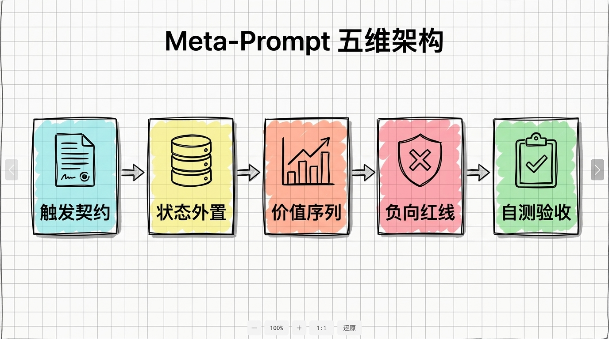
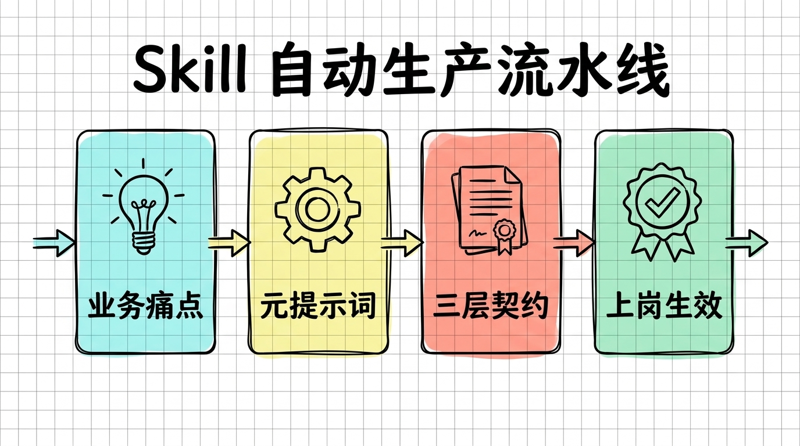

> **[《AI Agent Skill 架构与生产级实战全书》](../../README.md)**  
> 上一章：[第 01 章：重新理解 Skill：给 AI 发一张“上岗资格证”](01-重新理解Skill_给AI发一张上岗资格证.md) ｜ [返回总目录](../../README.md) ｜ 下一章：[第 03 章：代码防腐实战：用价值序列表专治 AI 屎山与过度抽象](03-代码防腐实战_用价值序列表专治AI屎山与过度抽象.md)

# 第 02 章 授人以渔：用 AI Agent 从 0 到 1 编写 Skill 的元提示词工程

在上一章理清了 Skill 是给 AI 颁发的“上岗资格证”之后，我最初陷入了一个非常尴尬的误区：**我试图完全凭借人工键盘，逐字逐句手敲每一份规则文件。**

那时候只要手头开了一个新项目，我就在项目根目录下一个字一个字写规范。

从变量命名、目录约定，一直写到各种边界异常的处理要求。

但连续折腾了几个模块之后，我发现这种纯手工手敲的做法不仅效率极其低下，而且写出来的规则在真实开发中漏洞百出。

最直观的表现就是，我费尽心思写了一下午的规约，AI 在实际写代码时依然会频繁装傻充愣，很多自以为交代得很清楚的原则，直接被模型视若无睹。

# 1. 破除手写迷信：为什么手工写的规则总被 AI 忽视？

回过头复盘那些被 AI 彻底无视的手写规则，我发现人工编写在对抗大模型时，天生存在两个致命短板。

## 1.1. 防御盲区漏成筛子

人类在日常思考时，思维惯性通常只聚焦于“希望对方做什么”，而极少会系统性地把“严禁对方做什么”全部罗列穷尽。

当我手工写一条“请注意代码解耦”的规则时，我脑子里默认以为 AI 懂得适可而止。

但在大模型的注意力世界里，没有明确写进负向禁令的行为，就等同于完全被默许。

它完全可以在打着“架构解耦”的旗号下，顺手写出五个毫无意义的抽象接口与中间转换层，把原本清爽的业务逻辑切割得七零八落。

单靠人工经验，根本无法提前预判大模型在概率生成中会钻出多少稀奇古怪的偏门漏洞。

## 1.2. 形容词泛滥导致裁决失效

手工写规则的另一个常见通病，是大量充斥着无法量化落地的形容词。

像“代码要简洁”、“性能要优秀”、“结构要优雅”这类话，在日常团队沟通中听起来很有道理，但一旦丢给大模型，就变成了彻底失效的废话。

模型根本不知道在面对“为了极致精简而牺牲某些配置灵活性”的冲突时刻，到底哪一个指标排在第一位。

缺乏确定性的优先级裁决顺序，模型在每次生成时就会在不同风格之间来回摇摆，产生极其不可控的随机漂移。

要想彻底破局，必须转变心智：**生产级 Skill 绝不能靠手敲，必须让 AI Agent 亲自成为这套工具的工业母机。**

这就需要一套结构极其严密的元提示词框架。

# 2. Meta-Prompt 五维架构：打造 Skill 的工业母机

所谓 Meta-Prompt（元提示词），本质上就是“用来指导 AI 编写 AI 规则的高阶提示词”。

它就像工业生产中的精密模具，把原本散落的一句话需求，冲压成符合工程安全标准的规约文件。

经过数十次真实项目排错的迭代，我把生产级 Skill 的生成框架沉淀为了五个核心维度。



## 2.1. 触发契约：精确圈定执行半径

任何一个优秀的技能，首先必须讲清楚它在什么时候绝对不能多管闲事。

在元提示词中，不仅要让模型提取出正向的激活关键词，更要强制模型反向思考出至少三条严禁触发的负向场景。

只有圈定好了绝对的禁区边界，不同的 Skill 之间才不会在同一个会话中产生混乱的抢权与打架。

## 2.2. 状态外置：建立跨会话物理记忆

大模型的即时会话窗口随时可能被关闭或重置。

如果一个技能需要支撑复杂任务，就必须在元提示词里强制它把运行状态固化到本地的具体文件里。

绝不能允许它凭空依靠上下文记忆来进行跨步骤推理，状态落盘是维持工程稳定性的生命线。

## 2.3. 价值序列：终结两难冲突的裁决法

在真实代码编写中，架构解耦与精简行数常常发生不可调和的矛盾。

元提示词必须逼迫模型给出一份不可动摇的优先级裁决表，明确界定当 A 遇到 B 时到底无条件服从谁。

有了这条毫无歧义的价值准绳，AI 在面对工程复杂局面时才不会擅自自作主张。

## 2.4. 负向红线：用绝对禁令堵死后门

在生成规约时，必须设立至少五条以“严禁……”开头的不可抗拒红线。

专门针对 AI 容易自作多情的高发区，比如严禁为了十行逻辑写设计模式、严禁臆造不存在的外部库、严禁编写无意义的废话注释。

每一条红线都应当是踩过坑之后交出的真金白银的学费。

## 2.5. 自测验收：让 Agent 自行审查

最后一步，是强制模型给出验证这套技能是否生效的最小测试契约。

模型必须提供一段故意诱导犯错的反例测试流程，只有当规则能精准拦截住这种诱导时，整套 Skill 才算真正交付合格。

# 3. 复制即用：工业级 Meta-Prompt 核心模板

基于上述五维架构，我把平日在 Cursor、Trae 和 Claude Code 中高频使用的生成提示词精简到了最核心的骨架。

遇到任何想要打造的新技能，直接把这段模板复制进 AI 对话框，替换其中的业务痛点即可。

```markdown
请充当 AI Agent 架构专家，为我生成符合生产规范的 SKILL.md。
输入核心诉求：[例如：专治前端组件过度抽象，控制代码行数]

生成契约必须严格满足以下五大硬约束：
1. 触发契约：明确定义激活场景，并列出至少 3 条【严禁触发】的边界。
2. 状态外置：指定本地持久化文件（如 state.md），禁止依赖脆弱上下文。
3. 价值序列：给出明确优先级（例如：代码在正确位置 > 行数少 > 抽象层级多）。
4. 负向红线：列出 5 条以【严禁】开头的绝对禁令，杜绝过度封装与臆造依赖。
5. 自检验收：提供一段最小诱导测试用例，证明该规则具备即时拦截能力。
输出形式：仅输出结构严密的 Markdown 文本，绝不包含空洞开场白。
```

这段提示词没有一个多余的废字，但它给模型套上了极强的思维夹板，逼迫模型输出可以直接落地的工程规范。

# 4. 从一句话到生产级 Skill：完整实战演练

为了检验这套元提示词的威力，我以日常最头疼的“接口性能与异常审计”为例，进行了一次完整的端到端实操演练。



我的原始输入极其简短，只有一句话：“我想要一个专门审计接口响应时间、拦截未捕获异常的技能”。

把上面的 Meta-Prompt 连同这句需求丢给 AI 之后，不到十秒钟，AI 就输出了一份结构极其严密的 `SKILL.md`：

```markdown
---
name: api-auditor
description: "API 审计专家。监控接口耗时，强制异常捕获边界，拦截慢查询与野指针风险。"
---

# API 审计与防御规约

## 1. 触发契约
- 触发：编写外部 HTTP 接口、修改数据库查询、处理异步任务时。
- 严禁：纯前端静态页面排版、修改本地 Mock 数据、日常日志级别微调。

## 2. 价值序列（优先级裁决）
1. 错误必须显式暴露 > 静默吞掉异常
2. 关键路径超时熔断 > 无限制异步等待
3. 本地原生精简实现 > 引入笨重监控 SDK

## 3. 负向防御红线（绝对禁令）
- 严禁在未经 try-catch 保护的异步函数中直接操作底层连接池。
- 严禁对外暴露包含内部堆栈信息的敏感报错字符串。
- 严禁任何单次数据库查询缺失超时时间硬约束。
```

生成的整个文件紧凑有力，没有任何套话废话。

不仅明确规定了什么情况下不能乱插手，更在负向红线里死死封死了“吞异常”和“泄露敏感堆栈”等高频隐患。

我随后在编辑器里新建了一个控制器进行诱导测试，故意让 AI 帮我写一段“快速查询并直接返回数据”的代码。

在没有这个 Skill 之前，AI 往往会图省事直接写一个裸查函数；但在挂载了该 Skill 之后，编辑器立刻拦截了裸查行为，主动补齐了超时控制与标准异常包装。

从产生想法到生产出这样一个立竿见影的守卫工具，整个过程耗时不到两分钟。

# 5. 写在最后

从用键盘痛苦手敲规则，到用 Meta-Prompt 指挥 AI 批量工业化生产 Skill，这种认知迭代彻底解放了一线开发者的生产力。

只要掌握了模具的构造法则，任何人都能针对自己团队的独特痛点，像搭积木一样迅速拉起一套专属的技能护栏。

但随着手头的规则文件越来越多，新的工程挑战又悄然而至：

即便手里拥有了严密的规则模具，但在真实的代码重构战场上，面对几千行盘根错节的陈年老代码，模型究竟该如何顶住压力，实施最彻底的“代码瘦身”与“结构防腐”？

下一章，将进入实战篇的核心重头戏：**深度解剖专治 AI 屎山代码的实战利器——Code-Slim，并完整开源其背后的价值序列表与工程防腐源码。**

<br/>

> 上一章：[第 01 章：重新理解 Skill：给 AI 发一张“上岗资格证”](01-重新理解Skill_给AI发一张上岗资格证.md) ｜ [返回总目录](../../README.md) ｜ 下一章：[第 03 章：代码防腐实战：用价值序列表专治 AI 屎山与过度抽象](03-代码防腐实战_用价值序列表专治AI屎山与过度抽象.md)

<br/>

<div align="center">

### 读者交流与支持

若在阅读本章时有所启发或遇到疑问，欢迎关注公众号或与作者交流：

<table class="author-card" align="center">
<tr>
<td align="center">
<br/>
<b>关注微信公众号【艺杯羹】</b><br/>
<sub>第一时间获取深度技术思考与开源更新</sub>
</td>
<td align="center">
<br/>
<b>请作者喝杯咖啡</b><br/>
<sub>如果觉得内容有所启发，感谢赞赏鼓励</sub>
</td>
</tr>
</table>

**博主**：艺杯羹 ｜ **微信**：`peace-83`（备注：Skill实战交流） ｜ **QQ**：`3057454077`  
[个人主页](https://yibeigen.pages.dev/) · [CSDN 博客](https://blog.csdn.net/qq_46987323?spm=1000.2115.3001.5343) · [新浪微博](https://www.weibo.com/u/7583841270) · [欢迎给 GitHub 仓库点个 Star](../../README.md)

</div>
