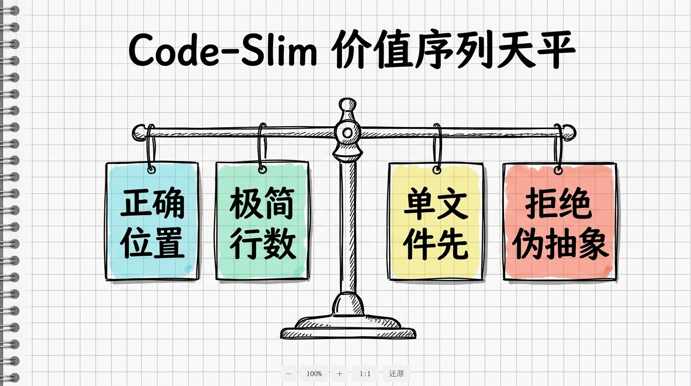
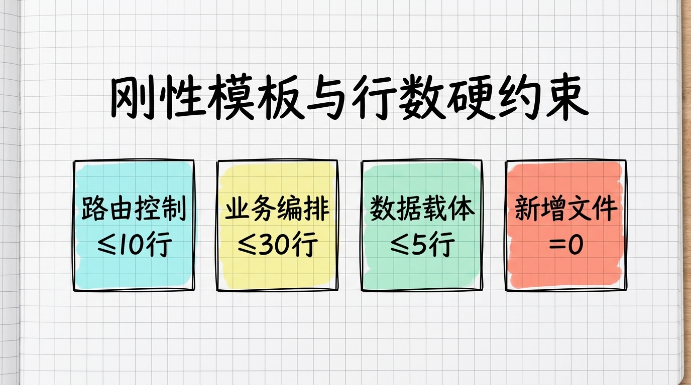

> **[《AI Agent Skill 架构与生产级实战全书》](../../README.md)**  
> 上一章：[第 02 章：授人以渔：用 AI Agent 从 0 到 1 编写 Skill 的元提示词工程](02-授人以渔_用AIAgent从0到1编写Skill的元提示词工程.md) ｜ [返回总目录](../../README.md) ｜ 下一章：[第 04 章：研发自愈与外置记忆：双层复盘机制构建项目专属抗体](04-研发自愈与外置记忆_双层复盘机制构建项目专属抗体.md)

# 第 03 章 代码防腐实战：用价值序列表专治 AI 屎山与过度抽象

在掌握了用元提示词批量打造 Skill 的工业方法之后，日常写代码时最让人抓狂的一个问题随即摆在眼前：**AI 实在太喜欢写多余的代码了。**

不管是让它追加一个微小的业务字段，还是对现有逻辑做一点微调，只要交代下去，AI 就很容易自作主张地大兴土木。

一个原本只需要在已有函数里加两行条件判断的事，丢给 AI 之后，它经常会煞有介事地新建好几个文件，塞进来一大堆策略接口、工厂类与过度设计的抽象包装器。原本十几行就能干脆利落收工的代码，硬生生被它扩写成上百行的抽象迷宫。

审查这样的代码，比自己从零手写还要疲惫得多。

如果放任这类代码合进项目，代码库很快就会滑向难以维护的屎山。AI 在写代码时最大的危险从来不是“写错”，而是“写多”。

# 1. 为什么 AI 越聪明，生成的代码反而越冗余？

面对 AI 肆意堆砌的抽象层，起初我也感到非常困惑：大模型的推理能力明明越来越强，为什么反而更容易写出冗长臃肿的过度设计？

深入剖析大语言模型的底层奖励机制之后，我才发现了这背后的认知错位。

AI 的训练语料来自于全网海量的开源项目与教科书代码。在公开语料的评价体系里，大量包含设计模式、分层解耦、接口抽象的代码往往被冠以“架构严谨”、“企业级规范”的高赞标签。

这就导致大模型在概率生成中形成了一个根深蒂固的潜意识偏好：**多写比少写安全，复杂比简单显得专业。**

而在严谨的真实工业生产中，工程的第一定律恰恰完全相反：**少比多安全，每一行多余的代码都是未来不得不偿还的维护债务。**

当开发者在聊天框里口头叮嘱它“请写简单一点”时，这种软绵绵的自然语言提示根本无法形成对抗概率偏好的物理抓手。

模型在面临“为了扩展性引入工厂类”还是“直接在原文件写个 private 方法”的选择关头，缺乏一套具备刚性裁决力的工程天平。

只要没有物理级别的规则锁死它的手脚，它就会在自以为是的“企业级优雅”中一路狂奔，最终把工程拖入屎山的泥潭。

# 2. 三种代码膨胀形态与定点清除策略

要想根治代码膨胀，必须先精准识别代码是在哪一个层级发生了病变。

在日常高强度的 AI 编码中，我将 AI 制造的代码膨胀划分为三种截然不同的形态。

## 2.1. 表层膨胀：无需动用 Skill 的皮外伤

表层膨胀主要表现为废话连篇的行内注释、未被使用的冗余导入包、以及轻微重复的工具类方法。

比如明明代码写着 `user.setName(name)`，AI 非要在上方贴一行 `// 设置用户姓名`。

这种问题虽然看着烦人，但并不伤筋动骨。标准的静态代码检查工具（如 ESLint、Prettier、Checkstyle）就能在保存文件的一瞬间自动格式化并清除多余导入，完全不值得为此专门设计一套昂贵的 Skill。

## 2.2. 深层膨胀：提前预支未来的伪架构

深层膨胀是 AI 最常犯的毛病，其本质是“为未来可能发生、但现在根本不需要的场景提前设计”。

典型的症状包括：为一个只有一个实现的接口定义独立的抽象层、引入复杂的建造者模式包装原本只有三个属性的对象、以及硬生生搞出一大堆可配置的空壳策略类。

这种膨胀极大增加了代码阅读者的认知负担。对付深层膨胀，唯一的解法是使用刚性模板限制 AI 的发挥空间，剥夺它随意设计抽象层级的自由度。

## 2.3. 结构侵蚀：最致命的架构溃烂

如果说深层膨胀只是让代码变胖，那么结构侵蚀则是直接让架构变质。

结构侵蚀最典型的现场，就是代码长错了位置：AI 为了省事，直接把几十行复杂的数据库查询与核心业务计算塞进了 Controller 控制器；或者反过来，在底层 Service 甚至 DAO 层里疯狂拼装前端专用的展示逻辑与 HTTP 响应头。

一旦职责跨界，整个系统的模块边界就会在几天之内彻底瓦解。这是最危险的工程病变，一旦发现，必须勒令立即重写。

# 3. 价值序列裁决法：用物理天平终结两难选择

针对深层膨胀与结构侵蚀，我在开源的 `Code-Slim` 技能中设计了一套核心武器——**价值序列表（Value Hierarchy）**。

当模型在生成代码的十字路口遭遇冲突时，它不需要自行猜测，必须严格遵循这套由高到低的绝对裁决天平：



在具体的工程执行中，这套天平的裁决链条极其严密：

```text
代码在正确的位置 > 代码行数少
代码行数少 > 抽象层级多
一个文件搞定 > 关注点分离
先硬编码 > 先配置化
让异常传播 > 吞掉异常
代码自解释 > 写注释解释
追问确认需求 > 直接开始编码
增量追加到已有文件 > 创建新文件
50行能跑的代码 > 200行"更优雅"的代码
不改变行为的前提下删减 > 保留膨胀代码
改变行为的删减 = 错误，必须回退
测试友好度 > 行数最少
```

## 3.1. 正确位置永远高于行数精简

天平的第一条法则就死死守住了架构的底线。

如果一段业务代码本该属于领域服务层，即便写在 Controller 里只需要五行、写在 Service 里需要十五行，模型也必须坚决写在 Service 中。代码位置一旦错乱，行数再少也是毒药。

## 3.2. 单文件优先终结伪解耦

大模型特别热衷于把一个简单的函数拆散到五个不同的文件里，美其名曰“关注点分离”。

在 Code-Slim 的裁决体系下，**能在一个文件里内聚搞定的逻辑，坚决禁止新建文件**。

过早的解耦本质上就是将简单的阅读成本转化为高昂的跳转成本。只有当逻辑自然膨胀到单个文件容纳不下时，才允许人类开发者手动主导拆分。

## 3.3. 先硬编码后配置化

AI 极其喜欢为每一个参数甚至文案建立一个独立的常量配置文件。

然而真实业务中，百分之九十的参数终其一生都不会被修改。Code-Slim 强制要求优先就地硬编码，杜绝为了虚无缥缈的“未来配置化”而制造出大量毫无价值的配置中间层。

# 4. 刚性模板与行数硬约束：给代码戴上金箍

光有抽象的价值序列还不够，大模型需要更具象、可量化的物理卡点。

在 Code-Slim 中，我将工程规范直接量化为具体的行数上限与模板结构：



## 4.1. 路由控制方法：绝对不得超过 10 行

Controller 控制器方法的唯一天职就是路由转发与参数绑定。

它只能执行三件事：接收前端请求、调用对应的 Service 方法、将结果打包返回。

严禁在 Controller 中进行任何形式的业务逻辑运算、数据格式清洗、或者直接捕获业务异常。单方法如果超过 10 行，直接判定为结构侵蚀，触发重写流程。

```typescript
// 规范示例：Controller 方法绝不超过 10 行，专注路由调度
@Post('/status')
async updateStatus(@Body() dto: UpdateStatusDto) {
    const result = await this.orderService.updateStatus(dto.orderId, dto.status);
    return Result.ok(result);
}
```

## 4.2. 业务编排方法：严格压制在 30 行以内

业务逻辑的核心承载地是 Service。但即便是 Service，单个业务方法的行数上限也必须被锁死在 30 行以内。

如果一个复杂业务必然超过 30 行，Code-Slim 严禁 AI 私自新建类或抽取策略接口，而必须将其就地拆解为同一 Service 类内部的多个私有步骤方法（如 `validateStock()`、`calculateDiscount()`）。

所有上下文变量通过局部参数在类内紧密流转，既保持了各步骤的高内聚，又杜绝了向外滥造垃圾文件的冲动。

## 4.3. 数据载体对象：精简至 5 行以内

DTO（数据传输对象）只能充当纯粹的数据容器。

在现代语言中，必须优先使用 Java Record 或 TypeScript 扁平接口。禁止在 DTO 中附带复杂的校验逻辑、转换函数或业务运算，单对象定义严格控制在 5 行以内。

## 4.4. 增量追加优先：新增文件数默认等于零

新功能必须优先追加到现有文件中，而不是每接一个需求就新建一个文件。

在 Code-Slim 的执行流中，**新增文件数 = 0 是不可动摇的默认值**。AI 只要试图在项目中创建新文件，就必须先停下来向开发者说明为什么不能追加到已有文件中，理由不充分则直接阻断创建。

# 5. 实战对比：一个被 AI 扩写成 200 行的业务如何被一键瘦身

为了直观感受这套裁决天平的威力，来看一个日常开发中最常见的微小需求：在已有业务中追加一段状态变更或优惠立减的校验逻辑。

在没有加载 Code-Slim 之前，AI 面对这种需求，极其喜欢自作聪明地搞出一整套抽象模式：

```typescript
// AI 自作多情生成的 180 行策略模式工厂迷宫（反面教材）
export interface DiscountStrategy { calculate(amount: number): number; }
export class NewUserDiscountStrategy implements DiscountStrategy {
    calculate(amount: number) { return Math.max(0, amount - 5); }
}
export class DiscountFactory {
    static getStrategy(type: string): DiscountStrategy {
        if (type === 'NEW_USER') return new NewUserDiscountStrategy();
        throw new Error('Unsupported discount type');
    }
}
// 后续还跟了 50 多行的策略注册器、构建器与结果包装器...
```

而当我们在项目中挂载了 Code-Slim 技能之后，AI 在生成前必须先接受价值序列表的裁决：

“代码在正确位置 > 行数少”、“行数少 > 抽象层级多”、“新增文件数 = 0”。

AI 的整个生成思路被瞬间纠正。它不再去臆造工厂和策略类，而是在现有的 `OrderService` 中追加了极其干净利落的极简实现：

```typescript
// 挂载 Code-Slim 后：零新增文件，在已有 Service 中就地追加 12 行纯粹逻辑
async applyDiscount(orderId: string, amount: number): Promise<number> {
    const isNewUser = await this.userRepo.checkNewUser(orderId);
    if (!isNewUser) return amount;
    
    const finalAmount = Math.max(0, amount - 5);
    await this.orderRepo.updateAmount(orderId, finalAmount);
    return finalAmount;
}
```

没有额外的文件，没有无意义的接口，没有套娃的工厂，行为和最初预期的业务效果百分之百一致。

全套单元测试一次性全部绿灯通过，行数从原本的两百多行骤降至十来行，整体代码体积压缩了整整 90%。

真正优雅的代码，从来不是看往里面塞了多少设计模式，而是看能不能把所有多余的伪解耦全部剥离干净。

# 6. 源码自取与生产级装配

这套专治代码膨胀的防腐工具已经在 GitHub 上全面开源：

- **开源仓库地址**：[https://github.com/yibeigen/Code-Slim](https://github.com/yibeigen/Code-Slim)
- **直接查看核心契约**：[Code-Slim SKILL.md 源码](https://github.com/yibeigen/Code-Slim/blob/main/SKILL.md)

如果需要在自己的项目中使用，装配过程极其简单：

只需在项目根目录创建 `.agents/skills/code-slim/` 文件夹，将仓库中的 `SKILL.md` 拷贝进去。

无论是使用 Trae、Cursor 还是 Claude Code，一旦涉及到新功能开发、历史重构或代码质量审查，编辑器就会自动激活该技能，全程监控 AI 的每一行代码输出，坚决杜绝屎山代码的滋生。

# 7. 写在最后

从任由 AI 肆意堆砌两百行伪抽象迷宫，到用价值序列表和刚性行数模板守住代码防腐的生命线，这是每一个严肃开发者在 Vibe Coding 时代必须掌握的防御工程。

至此，我们在前两章埋下的伏笔正式完成回收：
- 面对 AI 肆虐的屎山代码，我们交付了工业级开源武器 `Code-Slim`；
- 面对复杂重构中的多维冲突，我们用价值序列表的物理天平终结了模型的随机漂移。

然而，当代码膨胀的顽疾被彻底治愈之后，另一个更隐蔽、更折磨人的深层痛点又摆在了所有研发团队的面前：

在日常漫长的联调与调试过程中，我们和 AI 一起好不容易排查出一个极其刁钻的并发死锁或环境编码 bug，花了大半天时间终于调通。可是一旦关掉会话、换个新窗口，或者下周团队里的另一个同事遇到类似的报错，AI 依然会彻底失忆，把当初踩过的所有坑、犯过的所有错一模一样地再重新踩一遍。

难道每一次排错交出的昂贵学费，注定无法在工程内部形成永久抗体吗？

下一章，我们将进入全书的自愈与记忆核心篇：**深度拆解 `ai-task-troubleshooter`，用事实日志与第一性原理智慧层的双层解耦架构，彻底终结 AI 的换窗口失忆，打造项目专属的自愈免疫系统。**

<br/>

> 上一章：[第 02 章：授人以渔：用 AI Agent 从 0 到 1 编写 Skill 的元提示词工程](02-授人以渔_用AIAgent从0到1编写Skill的元提示词工程.md) ｜ [返回总目录](../../README.md) ｜ 下一章：[第 04 章：研发自愈与外置记忆：双层复盘机制构建项目专属抗体](04-研发自愈与外置记忆_双层复盘机制构建项目专属抗体.md)

<br/>

<div align="center">

### 读者交流与支持

若在阅读本章时有所启发或遇到疑问，欢迎关注公众号或与作者交流：

<table class="author-card" align="center">
<tr>
<td align="center">
<br/>
<b>关注微信公众号【艺杯羹】</b><br/>
<sub>第一时间获取深度技术思考与开源更新</sub>
</td>
<td align="center">
<br/>
<b>请作者喝杯咖啡</b><br/>
<sub>如果觉得内容有所启发，感谢赞赏鼓励</sub>
</td>
</tr>
</table>

**博主**：艺杯羹 ｜ **微信**：`peace-83`（备注：Skill实战交流） ｜ **QQ**：`3057454077`  
[个人主页](https://yibeigen.pages.dev/) · [CSDN 博客](https://blog.csdn.net/qq_46987323?spm=1000.2115.3001.5343) · [新浪微博](https://www.weibo.com/u/7583841270) · [欢迎给 GitHub 仓库点个 Star](../../README.md)

</div>
