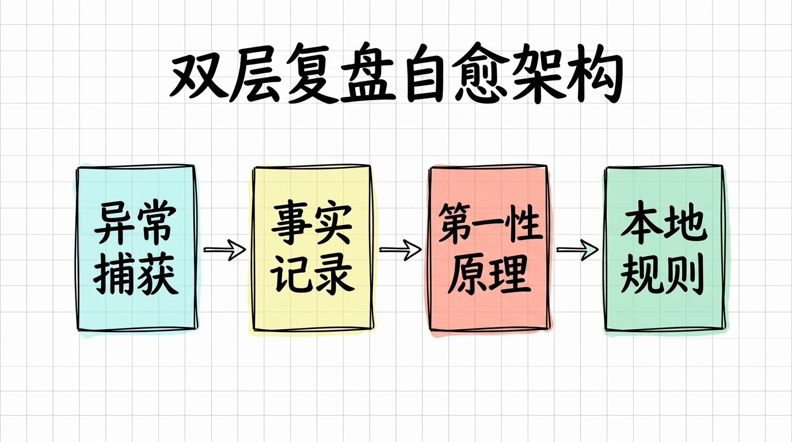
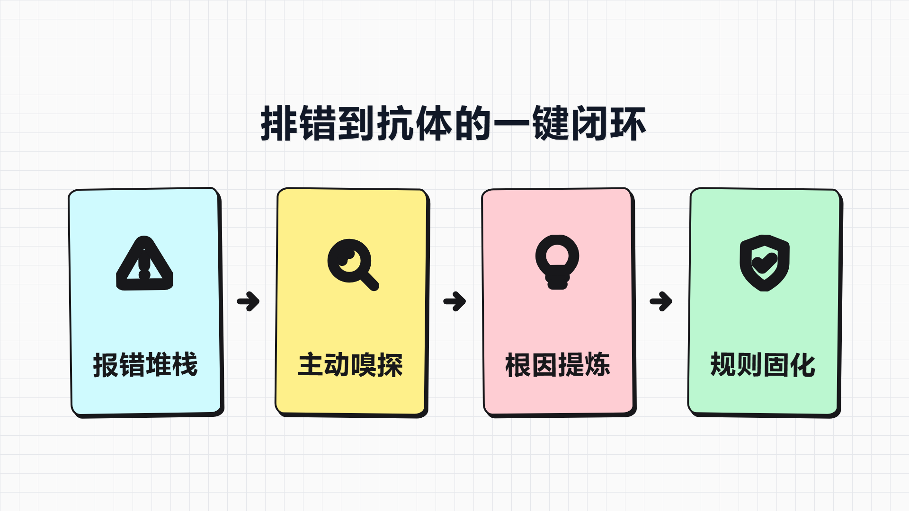

> **[《AI Agent Skill 架构与生产级实战全书》](../../README.md)**  
> 上一章：[第 03 章：代码防腐实战：用价值序列表专治 AI 屎山与过度抽象](03-代码防腐实战_用价值序列表专治AI屎山与过度抽象.md) ｜ [返回总目录](../../README.md) ｜ 下一章：[第 05 章：多人协作防撞车：泳道隔离与红线防御机制](05-多人协作防撞车_泳道隔离与红线防御机制.md)

# 第 04 章 研发自愈与外置记忆：双层复盘机制构建项目专属抗体

在解决了 AI 肆意堆砌屎山代码的膨胀顽疾之后，日常开发中另一个折磨人的工程陷阱随即暴露无遗：**AI 的换窗口失忆症。**

在高强度使用 AI 写代码的过程中，最让人心力交瘁的时刻，往往不是遇到报错，而是遇到曾经排查过的报错。

有些隐蔽的并发死锁、环境编码冲突或异步时序 bug，排查过程极其折磨。我和 AI 一起读日志、加断点、改配置，反复试错了三四次，花了整整两三个小时，终于把底层的深水坑彻底填平、业务恢复正常。

可只要一关掉对话框，或者随着代码增长开启了一个新的聊天窗口，所有的排错记忆便彻底归零。

当下一次在类似场景触发同一类隐患时，新窗口里的 AI 依然会表现得像个毫无经验的新手，把当初踩过的每一个坑、犯过的每一次低级错误，一模一样地再重新踩一遍。

排错交出的昂贵学费，如果无法在工程内部固化为物理抗体，团队就永远在同一条阴沟里反复翻车。

# 1. 换个窗口就失忆：上下文重置背后的工程痛点

很多开发者在排查完一个复杂问题之后，习惯在对话框里对 AI 说一句：“下次遇到这个问题，记得用这种方法处理”。

这种口头叮嘱除了给自己提供心理安慰之外，在工程层面没有任何实际价值。

大语言模型的即时上下文窗口是易失的物理介质。随着会话 token 消耗殆尽或主动重置会话，模型对上一个窗口发生的事情根本毫无知觉。

更有甚者，很多团队也尝试过写复盘文档，但往往迅速走向两个极端。

一种是文档过度碎片化。每排查一个 bug，就让 AI 在项目里随手新建一个独立的 Markdown 文件。做完两三个需求后，项目文档目录下堆满了二三十个零碎的排错记录，既没人去翻看，模型也根本无法在有限的上下文里同时加载这么多杂乱的文件。

另一种是记录流于表面。许多记录只停留在“把某行代码改成某个函数”，完全没有下潜到操作系统机制、I/O 边界或大模型注意力扩散的底层根因。缺乏物理规律穿透的琐碎记录，根本无法提炼成可复用的工程规则。

要想让排错经验跨越窗口重置而永久留存，必须建立一套将经验外置固化的自愈机制。

# 2. 事实层与智慧层解耦：双层文档物理架构

为了终结换窗口失忆的死循环，我在开源的 `ai-task-troubleshooter` 技能中，设计了一套将**事实记录层**与**第一性原理智慧层**严格解耦的双层文档架构：



这套架构的核心心智极其纯粹：**事实只管集中追加，智慧按需深度升华。**

## 2.1. 第一层：集中追加的单文档事实流水（Tier 1）

所有日常排查、踩坑过程与即时解法，默认全部集中追加到唯一的主文档中（中文项目为 `docs/问题排查与解决记录.md`）。

每一条记录仅提取最核心的三个关键要素：
- **遇到什么事**：精准记录现场现象与报错堆栈的关键片段；
- **怎么解决的**：如实记录中间走过的弯路（失败尝试）以及最终验证有效的解决方案；
- **即时避坑点**：用一句话点出最直接的操作红线。

严禁每排查一个问题就新建一个文件。将所有事实集中在一个主文档中，既极大降低了记录时的心理负担，又为后续的宏观规律提炼提供了连续的时间线切片。

## 2.2. 第二层：第一性原理智慧与 AI 规则赋能（Tier 2）

当第一层的事实流水积累了若干条之后，单纯查看流水账依然无法阻断未来的犯错。

此时通过特定指令，启动智慧层的**第一性原理提炼**。

这一步不再停留在“某某代码该怎么写”的表象，而是运用 5-Whys 深度归因法，穿透代码表层直击系统底层的物理机理：比如操作系统文件句柄的并发锁机制、不同平台的字符编码默认值、或者大语言模型在处理否定句时的注意力盲区。

提炼出的终极成果直接分为两个板块：
- **第一性原理本质剖析**：沉淀至 `docs/第一性原理经验总结.md`，供人类工程师在架构设计与技术选型时深度参考；
- **项目本地 AI 规则配置文件**：自动生成结构极其致密的 Markdown 代码块，可一键复制到项目的本地规则文件（如 `AGENTS.md`）中，转化为任何会话窗口启动时都会被动加载的最高防御规约。

# 3. 两种触发工作流：从排错到抗体的一键闭环

优秀的工程机制，必须尽可能降低人类的心智摩擦。

在 `ai-task-troubleshooter` 中，我设计了两种无缝嵌入研发日常的工作流闭环：



## 3.1. 日常排错：主动嗅探与免确认静默归档

在日常写代码时，最容易出现的状况就是：问题刚刚调通，人类开发者由于急于推进下一个业务，转头就忘了复盘。

为了解决遗忘问题，该技能提供了两种防御机制。

第一种是 **AI 智能主动嗅探**。当会话中经历了明显的报错调试、方案试错，且最终通过代码测试验证成功时，AI 会在解决回复的末尾主动附带一张轻量级的提议卡片：

> 💡 **排错经验沉淀提示**：本次排查定位并解决了 `[核心根因简述]`。为了防止后续重复踩坑，是否将本次排错经验记录到复盘文档？回复“记一下”即刻自动归档。

只要开发者简单回复一个“好”或“记一下”，AI 就会自动从先前的上下文里把现象、失败尝试、最终解法抽取出来，秒级追加到事实文档末尾。

第二种是 **全自动免确认静默归档**。对于高强度研发阶段，可在项目规则中配置 `auto_archive: true`。一旦修复报错，AI 自动在后台静默完成追加写入，彻底实现零心智负担的经验持久化。

## 3.2. 定点升华：从流水账到本地免疫规则

当一个迭代周期结束，或者事实流水积累了五到十条典型记录时，在对话框中发送一句“提炼第一性原理”或执行 `/summarize-retro`。

AI 会读取完整的事实流水，将分散的排错案例进行交叉聚类，剔除偶发的噪音，把反复出现的深层隐患提炼为不可动摇的本地规约。

原本散落在各个会话中的血泪学费，在这个瞬间正式转化为守护整个工程的自愈抗体。

# 4. 实战案例：从多进程乱码崩溃到专属 AI 抗体

为了看清这套双层架构的威力，来看一个在本地多进程协作开发中真实踩过的深水坑。

当时在一个需要并发读写本地缓存的任务中，由于不同进程在 Windows 环境下读写同一个 JSON 文件，频繁出现文件锁死与偶发乱码，导致整个后台进程直接崩溃。

在没有这套复盘机制之前，这类 bug 解决完就过去了，换个新窗口 AI 依然会写出缺乏编码保护的文件读写代码。

而在挂载了 `ai-task-troubleshooter` 之后，排错解决的第一时间，事实层便精准完成了追加沉淀：

```markdown
### [2026-09-28 14:20] 模块：cache-manager
- **现象**：Windows 下多进程并发写入 json 文件报文件被占用，偶发 GBK 乱码崩溃。
- **踩坑历程**：尝试增加 sleep 重试，但在高并发下依然死锁；尝试全局 try-catch，导致写入丢失。
- **最终解法**：采用带超时锁的写入包装，并在 open() 中显式强制 `encoding='utf-8'`。
- **即时避坑**：跨进程写文件严禁裸调系统 I/O，必须显式锁+全链路 UTF-8。
```

当完成这一轮迭代、执行第一性原理提炼时，AI 穿透了“改几行代码”的表象，深挖出 Windows 默认 ANSI 编码机制与文件句柄独占机制的物理冲突，并直接在智慧层产出了可直接装配的规则块：

```markdown
// 提炼并一键导入项目本地 AGENTS.md 的自愈抗体规则：
## 本地文件 I/O 并发防护红线
1. 涉及本地文件写入，严禁裸调用基础写入函数，必须统一使用带超时竞争的原子锁工具。
2. 所有文本流读写必须显式声明 UTF-8 编码，严禁依赖任何运行环境的默认字符集。
```

当这几行致密的规则落入项目的全局规则后，后续无论开启多少个全新对话窗口，只要 AI 试图编写任何涉及本地文件操作的代码，这项抗体都会在底层直接生效，彻底封死犯错的可能。

一次排错，终身受益；一人踩坑，全队免疫。

# 5. 源码自取与生产级复盘落地

这套外置记忆与自愈免疫系统同样已经在 GitHub 上全面开源：

- **开源仓库地址**：[https://github.com/yibeigen/ai-task-troubleshooter](https://github.com/yibeigen/ai-task-troubleshooter)
- **直接查看核心契约**：[ai-task-troubleshooter SKILL.md 源码](https://github.com/yibeigen/ai-task-troubleshooter/blob/main/SKILL.md)

装配到自己的项目中只需一步：

在项目的 `.agents/skills/ai-task-troubleshooter/` 目录下放置 `SKILL.md`。

只要在对话中提到“记录这次排错”、“总结项目经验”或者输入 `/retro`，AI 就会立刻调动双层机制，守护项目的每一次经验沉淀。

# 6. 写在最后

从任由宝贵经验随窗口重置而灰飞烟灭，到用双层解耦架构将排错学费固化为物理抗体，这是工程自愈体系的核心基石。

到目前为止，全书的单兵作战防御链已经完整闭环：
- 用第 1 章的 **上岗资格证** 确立了防御底线；
- 用第 2 章的 **Meta-Prompt** 实现了技能的工业化批量生产；
- 用第 3 章的 **Code-Slim** 治愈了代码的屎山膨胀与伪抽象；
- 用本章的 **ai-task-troubleshooter** 彻底解决了换窗口失忆的断层。

然而，当个人的代码既防腐又具备自愈免疫能力之后，工程规模进一步扩张时的终极大山随即横亘在团队面前：

在真实的企业研发中，往往是多个开发者各自指挥着不同的 AI Agent 在同一个 Git 代码库里狂飙。

当开发者 A 的 AI 正在大刀阔斧重构公共组件，而开发者 B 的 AI 正在并行新增业务页面时，不同 Agent 之间根本无法感知彼此的存在。代码静默覆盖、接口调用越权、提交前把别人的最新改动全部刷掉——多人多 Agent 协同的代码踩踏事故几乎每天都在上演。

单兵武器已经就绪，团队战场的防御又该如何构建？

下一章，我们将正式迈入团队协作篇：**深度拆解 `vibe-team-lanes`，用泳道隔离规约与 Git 预检拦截机制，为多人多 AI 并行研发筑起坚不可摧的防撞车护栏。**

<br/>

> 上一章：[第 03 章：代码防腐实战：用价值序列表专治 AI 屎山与过度抽象](03-代码防腐实战_用价值序列表专治AI屎山与过度抽象.md) ｜ [返回总目录](../../README.md) ｜ 下一章：[第 05 章：多人协作防撞车：泳道隔离与红线防御机制](05-多人协作防撞车_泳道隔离与红线防御机制.md)

<br/>

<div align="center">

### 读者交流与支持

若在阅读本章时有所启发或遇到疑问，欢迎关注公众号或与作者交流：

<table class="author-card" align="center">
<tr>
<td align="center">
<br/>
<b>关注微信公众号【艺杯羹】</b><br/>
<sub>第一时间获取深度技术思考与开源更新</sub>
</td>
<td align="center">
<br/>
<b>请作者喝杯咖啡</b><br/>
<sub>如果觉得内容有所启发，感谢赞赏鼓励</sub>
</td>
</tr>
</table>

**博主**：艺杯羹 ｜ **微信**：`peace-83`（备注：Skill实战交流） ｜ **QQ**：`3057454077`  
[个人主页](https://yibeigen.pages.dev/) · [CSDN 博客](https://blog.csdn.net/qq_46987323?spm=1000.2115.3001.5343) · [新浪微博](https://www.weibo.com/u/7583841270) · [欢迎给 GitHub 仓库点个 Star](../../README.md)

</div>
